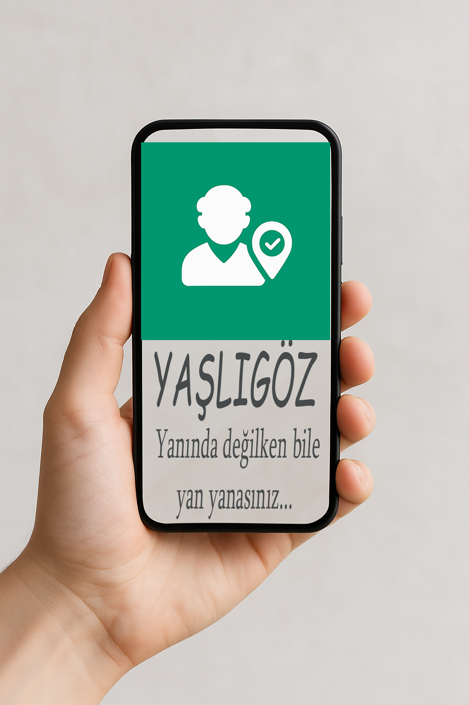
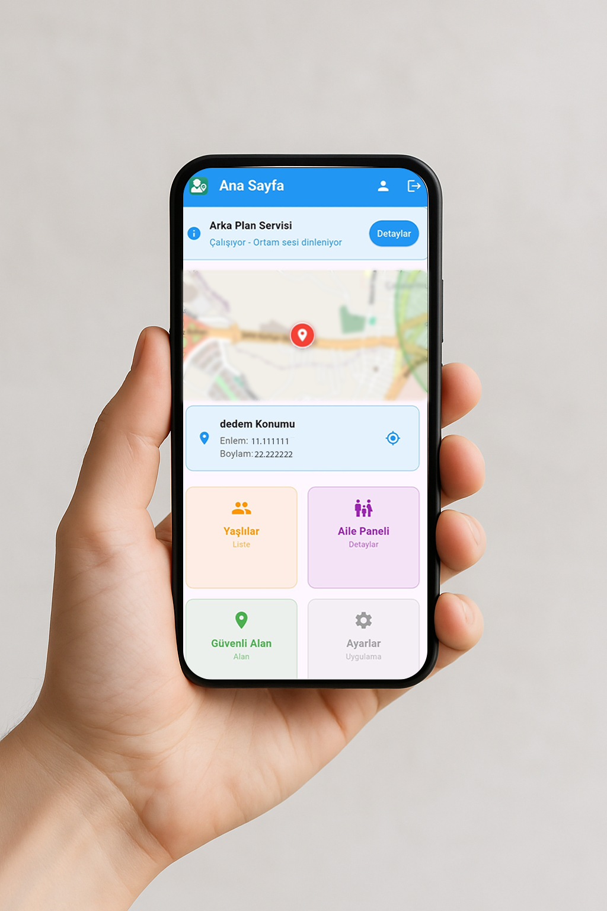
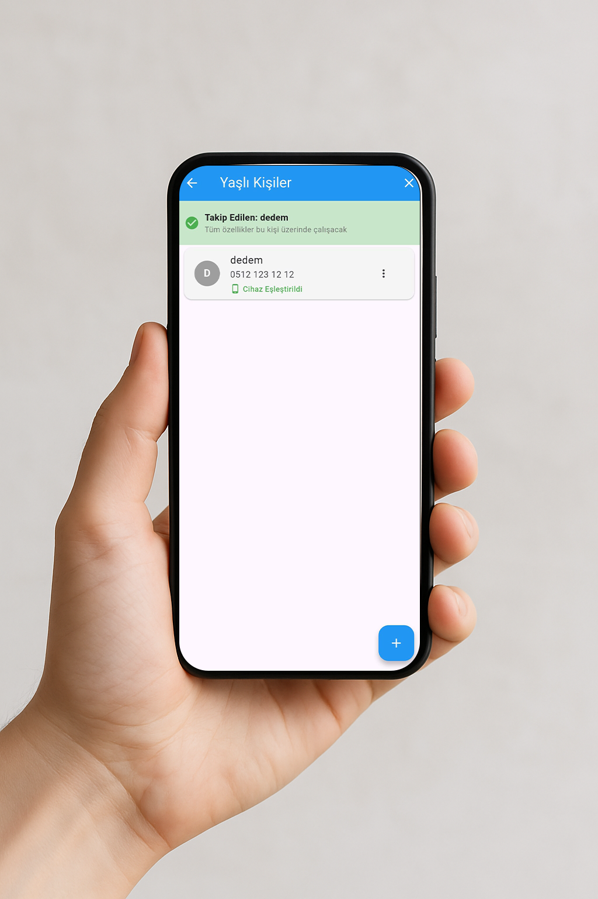
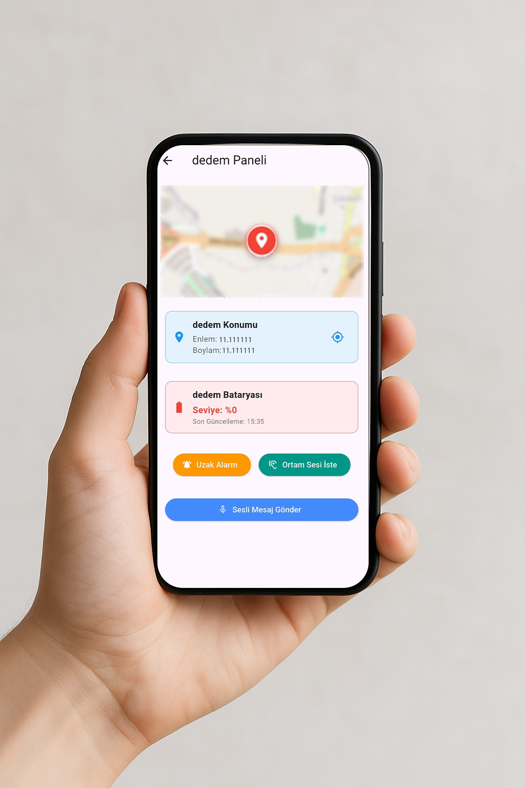
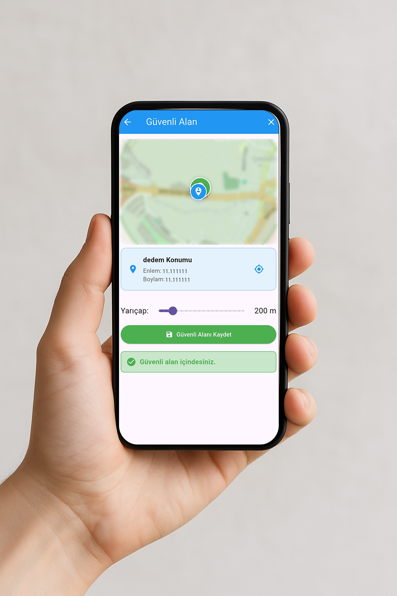
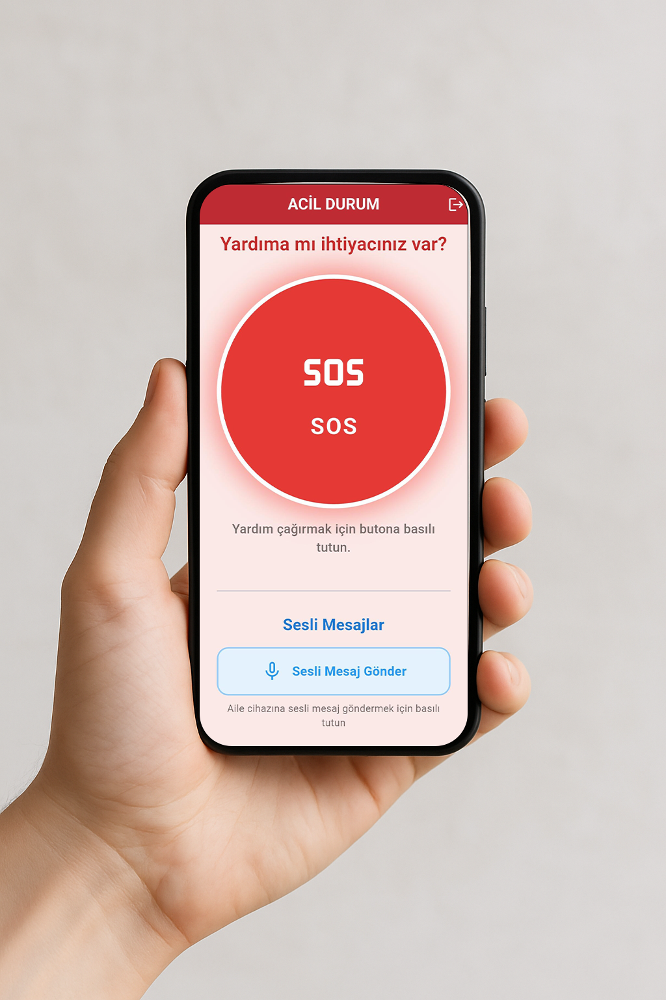
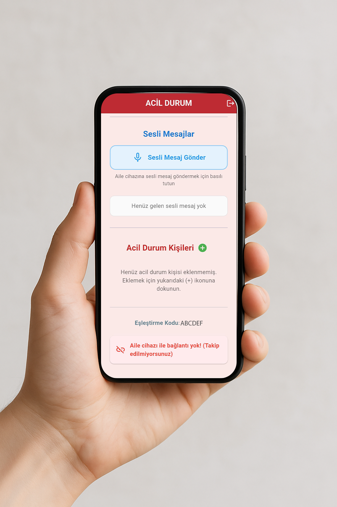

# YaşlıGöz - GPS Tabanlı Yaşlı Takip Uygulaması

<div align="center">
  

  <br/>
  <br/>

  [](https://flutter.dev)
  [](https://firebase.google.com)
  [](https://dart.dev)
  []()
  []()

</div>

---

## ⚠️ Önemli Not

**Bu repository sadece portföy ve vitrin amaçlıdır.** Kaynak kodlar ticari nedenlerle paylaşılmamaktadır. Bu sayfa, uygulama ekran görüntüleri ve genel bilgiler için oluşturulmuştur.

**Tüm hakları saklıdır. © 2024 Davut Can**

---

## 📱 Uygulama Ekran Görüntüleri

<div align="center">
  <table>
    <tr>
      <td align="center" width="25%">
        
        <br />
        <sub><b>Ana Ekran</b></sub>
      </td>
      <td align="center" width="25%">
        
        <br />
        <sub><b>Takip Listesi</b></sub>
      </td>
      <td align="center" width="25%">
        
        <br />
        <sub><b>Aile Paneli</b></sub>
      </td>
      <td align="center" width="25%">
        
        <br />
        <sub><b>Güvenli Alan</b></sub>
      </td>
    </tr>
    <tr>
      <td align="center" width="25%">
        
        <br />
        <sub><b>Yaşlı Kullanıcı Arayüzü</b></sub>
      </td>
      <td align="center" width="25%">
        
        <br />
        <sub><b>Kolay Kullanım Paneli</b></sub>
      </td>
      <td colspan="2"></td>
    </tr>
  </table>
</div>

---

## 🎯 Proje Hakkında

**YaşlıGöz**, yaşlı bireylerin güvenliğini sağlamak ve ailelerinin onları kolayca takip edebilmesini sağlamak için geliştirilmiş kapsamlı bir mobil uygulamadır. GPS teknolojisi, Firebase altyapısı ve kullanıcı dostu arayüzü ile sevdiklerinizin her zaman güvende olmasını sağlar.

### 💡 Proje Vizyonu

Yaşlı bireylerin bağımsızlığını korurken, ailelerin huzurunu sağlayan teknolojik bir çözüm sunmak.

---

## ✨ Temel Özellikler

<table>
<tr>
<td width="50%" valign="top">

### 🔍 Gerçek Zamanlı Takip
- GPS tabanlı anlık konum izleme
- Harita üzerinde gerçek zamanlı konum gösterimi
- Geçmiş konum verileri ve rota izleme
- Arka planda sürekli konum güncelleme
- Düşük batarya tüketimi optimizasyonu

### 🛡️ Güvenlik Özellikleri
- Güvenli alan (Geofencing) tanımlama
- Güvenli alandan çıkış bildirimleri
- Acil durum SOS butonu
- Anlık uyarı sistemi
- Şifreli veri iletişimi

### 👨‍👩‍👧‍👦 Aile Yönetimi
- Çoklu kullanıcı takibi
- Aile üyeleri yönetim paneli
- Kolay kullanıcı ekleme/çıkarma
- Rol bazlı erişim yönetimi
- Aile içi iletişim özellikleri

</td>
<td width="50%" valign="top">

### 🎤 İletişim & Bildirim
- Sesli mesaj gönderme/alma
- Anlık push bildirimleri
- Firebase Cloud Messaging
- Acil durum bildirimleri
- Özel bildirim tonları

### 🔋 Akıllı Yönetim
- Batarya durumu izleme
- Düşük batarya uyarıları
- Ağ bağlantı durumu kontrolü
- Otomatik senkronizasyon
- Veri tasarrufu modu

### 👴 Yaşlı Dostu Arayüz
- Büyük ve okunaklı butonlar
- Yüksek kontrast renkler
- Basit ve anlaşılır menüler
- Kolay navigasyon
- Sesli yönlendirmeler

</td>
</tr>
</table>

---

## 🛠️ Teknoloji Stack

### Frontend
- **Flutter** (SDK 3.8.1+) - Cross-platform mobil framework
- **Dart** - Programlama dili
- **Provider** - State management
- **Material Design** - UI/UX tasarım prensipleri

### Backend & Altyapı
- **Firebase Core** - Temel altyapı
- **Firebase Authentication** - Kullanıcı kimlik doğrulama
- **Firebase Realtime Database** - Gerçek zamanlı veritabanı
- **Firebase Storage** - Dosya depolama
- **Firebase Cloud Messaging** - Push bildirimleri
- **Firebase Functions** - Sunucu tarafı işlemler

### Konum & Harita
- **Geolocator** - GPS konum servisleri
- **Flutter Map** - Interaktif harita gösterimi
- **LatLong2** - Koordinat hesaplamaları
- **Geofencing** - Coğrafi sınır kontrolü

### Özel Servisler
- **Flutter Background Service** - Arka plan işlemleri
- **Flutter Local Notifications** - Yerel bildirimler
- **Audio Players & Recorder** - Ses işleme
- **Battery Plus** - Batarya yönetimi
- **Device Info Plus** - Cihaz bilgileri
- **Connectivity Plus** - Ağ yönetimi

### Güvenlik
- **Encrypt** - Veri şifreleme
- **Flutter Secure Storage** - Güvenli depolama
- **Crypto** - Kriptografi işlemleri

### Premium Özellikler
- **RevenueCat** - Abonelik yönetimi
- Premium kullanıcı özellikleri
- Gelişmiş analitik
- Öncelikli destek

---

## 📊 Teknik Mimari

```
┌─────────────────────────────────────────────┐
│           Flutter Application Layer          │
├─────────────────────────────────────────────┤
│                                             │
│  ┌──────────┐  ┌──────────┐  ┌──────────┐ │
│  │  Screens │  │ Services │  │  Models  │ │
│  └──────────┘  └──────────┘  └──────────┘ │
│                                             │
├─────────────────────────────────────────────┤
│              State Management               │
│              (Provider Pattern)             │
├─────────────────────────────────────────────┤
│                                             │
│  ┌─────────────────────────────────────┐   │
│  │       Firebase Services             │   │
│  │  • Auth  • Database  • Storage      │   │
│  │  • Messaging  • Functions           │   │
│  └─────────────────────────────────────┘   │
│                                             │
├─────────────────────────────────────────────┤
│            Native Platform APIs             │
│       (GPS, Notifications, Storage)         │
└─────────────────────────────────────────────┘
```

---

## 🔐 Güvenlik & Gizlilik

- **End-to-End Encryption**: Konum verileri şifrelenerek saklanır
- **Secure Authentication**: Firebase Authentication ile güvenli giriş
- **Data Privacy**: KVKK ve GDPR uyumlu veri yönetimi
- **Secure Storage**: Hassas bilgiler şifreli olarak cihazda tutulur
- **HTTPS Protocol**: Tüm veri iletişimi şifrelidir
- **Role-Based Access**: Kullanıcı yetkilerine göre erişim kontrolü

---

## 🎨 Tasarım Felsefesi

YaşlıGöz, **kullanıcı deneyimini** ön planda tutan bir tasarım felsefesine sahiptir:

- ✅ **Basitlik**: Karmaşık menüler yerine sade ve anlaşılır arayüz
- ✅ **Erişilebilirlik**: Büyük butonlar, yüksek kontrast, sesli geri bildirim
- ✅ **Güvenilirlik**: 7/24 kesintisiz çalışma garantisi
- ✅ **Performans**: Düşük batarya ve veri tüketimi
- ✅ **Modern UI**: Material Design 3 prensiplerine uygun tasarım

---

## 📈 Uygulama İstatistikleri

- **Platform**: Android & iOS
- **Minimum SDK**: Android 6.0 (API 23), iOS 12.0
- **Uygulama Boyutu**: ~45 MB
- **Ortalama Batarya Kullanımı**: %5-8 günlük
- **Veri Kullanımı**: ~10-15 MB/gün
- **Desteklenen Diller**: Türkçe

---

## 🎯 Hedef Kitle

- 👨‍👩‍👧 Yaşlı bireylere sahip aileler
- 👴👵 Bağımsız yaşayan yaşlı bireyler
- 🏥 Bakım evleri ve sağlık kuruluşları
- 👮 Alzheimer ve demans hastaları aileleri
- 🚑 Acil durum müdahale birimleri

---

## 💼 Proje Durumu

- ✅ **Production Ready**: Uygulama aktif olarak kullanılmaktadır
- ✅ **Fully Tested**: Kapsamlı testlerden geçirilmiştir
- ✅ **Optimized**: Performans ve güvenlik optimizasyonları yapılmıştır
- ✅ **Scalable**: Yüksek kullanıcı sayısına hazırdır

---

## 👨‍💻 Geliştirici

**Davut Can**
- 🔗 GitHub: [@davutcan15081](https://github.com/davutcan15081)
- 📧 İletişim: GitHub profili üzerinden

---

## 📝 Lisans & Telif Hakları

**© 2024 Davut Can - Tüm Hakları Saklıdır**

Bu proje **ticari ve özel mülkiyettir**. Kaynak kodlar, tasarım ve içerik üzerindeki tüm haklar geliştiriciye aittir.

- ❌ Kaynak kodların kopyalanması yasaktır
- ❌ Ticari kullanım yasaktır
- ❌ Dağıtım ve modifikasyon yasaktır
- ✅ Sadece görüntüleme ve portföy inceleme amaçlıdır

---

## 📞 İletişim & Destek

Proje hakkında sorularınız veya iş birliği teklifleriniz için:

- 📧 GitHub üzerinden mesaj gönderebilirsiniz
- 💼 Profesyonel iş birlikleri için iletişime geçin

---

## 🙏 Teşekkürler

Bu projeyi incelediğiniz için teşekkür ederim. YaşlıGöz, teknolojinin insanlık için nasıl bir fark yaratabileceğinin güzel bir örneğidir.

---

<div align="center">
  <p><i>"Teknoloji sevgiyle buluşunca, güvenlik doğar."</i></p>
  <br/>
  <p>❤️ <b>Flutter ile geliştirildi</b></p>
  <p>Made with ❤️ using Flutter</p>
  <br/>
  <p>⭐ Beğendiyseniz yıldız vermeyi unutmayın!</p>
</div>
